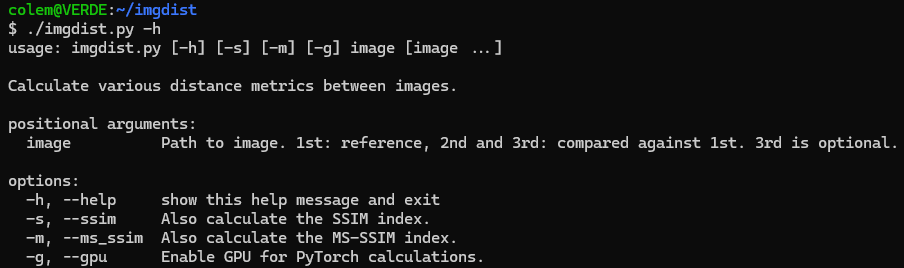
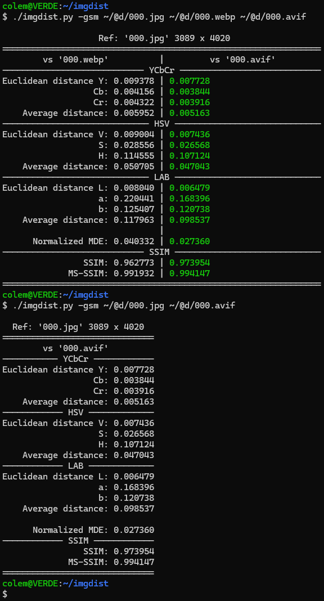

# Image Distance Metrics (imgdist)

A command-line tool to calculate and compare various perceptual distance metrics between images.




## Features

Calculates **normalized** Euclidean distances in the following color spaces (all scaled to 0-1 range):

- **YCbCr** (with proper channel ranges: Y=219, Cb/Cr=224)
- **HSV** (with circular distance correction for Hue channel)
- **LAB** (perceptual color space)

Additional metrics:

- **Normalized Mean Delta E (MDE)** - average perceptual color difference (0-1 range)
- **Structural Similarity Index (SSIM)** - structural similarity on luminance channel (-1 to 1 range, typically 0-1 in practice)
- **Multi-Scale Structural Similarity Index (MS-SSIM)** - multi-resolution structural similarity (-1 to 1 range, typically 0-1 in practice)

## Usage

### Basic comparison (2 images)

Compare one image against a reference:

Linux:

```bash
./imgdist.py reference.jpg compared.jpg
```

Windows:

```batch
py imgdist.py reference.jpg compared.jpg
```

### Advanced comparison (3 images)

Compare two images side-by-side against the same reference:

```bash
./imgdist.py reference.jpg imageA.jpg imageB.jpg
```

This will display both comparisons in a convenient two-column layout, with the better metric highlighted in green for each comparison.

### Options

* `-s`, `--ssim`: Calculate SSIM score
* `-m`, `--ms_ssim`: Calculate MS-SSIM score
* `-g`, `--gpu`: Use GPU for SSIM/MS-SSIM calculations (requires CUDA-enabled PyTorch)

### Examples

```bash
# Basic comparison with default metrics
./imgdist.py original.png compressed.png

# Include SSIM and MS-SSIM
./imgdist.py original.png compressed.png -s -m

# Compare two compression methods against original with GPU acceleration
./imgdist.py original.png method1.png method2.png -s -m -g
```

## Windows Setup (Optional)

Set file extension association once to run scripts directly:

```batch
assoc .py=Python.File
ftype Python.File="C:\WINDOWS\py.exe" "%L" %*
```

Then you can run:

```batch
imgdist.py [image1] [image2] [options]
```

## Output Format

The script displays results in an easy-to-read format:

- **Side-by-side comparison** when using 3 images
- **Color-coded results**: better values highlighted in green
- **Organized by color space** with clear separators
- **Average distances** computed for each color space
- Image dimensions displayed in the header

### Understanding the metrics

**Distance metrics** (YCbCr, HSV, LAB, MDE) are normalized to the **0-1 range**:

- **0 = identical images**, **1 = maximum possible difference**
- Lower is better (more similar images)

**Similarity metrics** (SSIM, MS-SSIM) have a theoretical range of **-1 to 1**:

- **1 = identical images** (perfect similarity)
- **0 = no similarity**
- **-1 = perfect anti-correlation** (inverted images)
- Higher is better. In practice with real images, values are typically in the 0-1 range.

The normalization of distance metrics allows for meaningful comparison across different color spaces and image sizes.

## Prerequisites

This script requires **Python 3** and the following libraries:

### Installation

Install most dependencies using pip:

```bash
pip install numpy Pillow pytorch-msssim
```

### PyTorch Installation

PyTorch installation depends on your system and CUDA support. Use the official command generator to get the correct version:

**[Visit the PyTorch "Get Started" page](https://pytorch.org/get-started/locally/)**

#### Example installations:

**CPU only (no GPU):**

```bash
pip3 install torch torchvision
```

**With CUDA support (e.g., NVIDIA GTX 1080 Ti with CUDA 12.x):**

```bash
pip3 install torch torchvision --index-url https://download.pytorch.org/whl/cu121
```

**Note:** Check your CUDA version with `nvidia-smi` and select the appropriate PyTorch build from the official website.

## Requirements

- **Same dimensions**: All compared images must have identical dimensions (width × height)
- **RGB images**: Images are converted to RGB internally
- **Supported formats**: Any format supported by PIL/Pillow (JPEG, PNG, BMP, TIFF, WebP, etc.)

## Technical Details

### Color Space Handling

- **YCbCr**: Uses standard ITU-R BT.601 ranges for normalization
- **HSV**: Applies circular distance for Hue channel (accounts for 0°/360° wrap-around)
- **LAB**: Uses PIL's LAB representation (0-255 scaled from CIE L\*a\*b\*)

### SSIM Calculation

- Computed on grayscale (luminance) channel as per standard definition
- GPU acceleration available with `-g` flag

### Performance Tips

- Use `-g` flag with CUDA-enabled GPU for faster SSIM/MS-SSIM on large images
- Images are preprocessed once and reused for all metrics
- For batch comparisons, consider scripting multiple invocations

## License

[CC0 1.0 Universal](https://creativecommons.org/publicdomain/zero/1.0/)