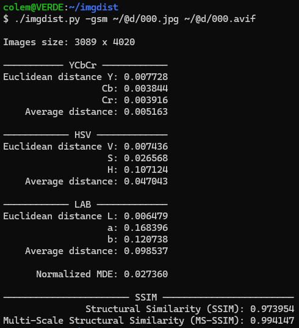

# Image Distance Metrics (imgdist)

A command-line tool to calculate and compare various perceptual distance metrics between two images.



## Features

Calculates normalized Euclidean distances in the following color spaces:
- YCbCr
- HSV
- LAB

It also computes:
- Normalized Mean Delta E (MDE)
- Structural Similarity Index (SSIM)
- Multi-Scale Structural Similarity Index (MS-SSIM)

## Usage

Linux:

```bash
./imgdist.py [image1] [image2] [options]
```

Windows:

```batch
py imgdist.py [image1] [image2] [options]
```

Or set file extension association once for Windows:

```batch
assoc .py=Python.File
ftype Python.File="C:\WINDOWS\py.exe" "%L" %*

imgdist.py [image1] [image2] [options]
```

### Options
* `-s`, `--ssim`: Calculate SSIM score.
* `-m`, `--ms_ssim`: Calculate MS-SSIM score.
* `-g`, `--gpu`: Use GPU for SSIM/MS-SSIM calculations

## Prerequisites

This script requires Python 3 and the following libraries.

You can install most of the dependencies using pip:
```bash
pip install numpy Pillow pytorch-msssim
```

### PyTorch

The installation command for PyTorch depends on your system and whether you have GPU (CUDA) support. It is highly recommended to use the official command generator on the PyTorch website to get the correct version for your setup.

[Visit the PyTorch "Get Started" page](https://pytorch.org/get-started/locally/)

For example, NVIDIA GeForce GTX 1080 Ti supports CUDA Version 13.0 and the command to install PyTorch is:
```bash
pip3 install torch torchvision --index-url https://download.pytorch.org/whl/cu129
```

